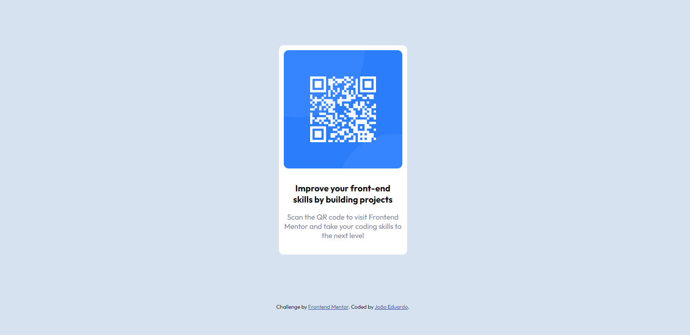

# Frontend Mentor - QR code component

This is a solution to the [QR Code Component on Frontend Mentor](https://www.frontendmentor.io/challenges/qr-code-component-iux_sIO_H). Frontend Mentor challenges help you improve your coding skills by building realistic projects. 

## Table of contents

- [Overview](#overview)
  - [The challenge](#the-challenge)
  - [Screenshot](#screenshot)
  - [Links](#links)
- [My process](#my-process)
  - [Built with](#built-with)
- [Author](#author)

## Overview

### The challenge

Users should be able to:

- See hover states for interactive elements

### Screenshot

### Links

- Solution URL: [Frontend Mentor Solution](https://www.frontendmentor.io/solutions/responsive-landing-page-using-css-flexbox-bZhlmga6Br)
- Live Site URL: [Live Site at GitHub Pages](https://joaocorner.github.io/QR-code-component//)

## My process

### Built with

- Semantic HTML5 markup
- CSS custom properties
- Flexbox
- Responsive Design

## Author
- Github - [joaocorner](https://github.com/joaocorner)
- Frontend Mentor - [@joaocorner](https://www.frontendmentor.io/profile/joaocorner)

